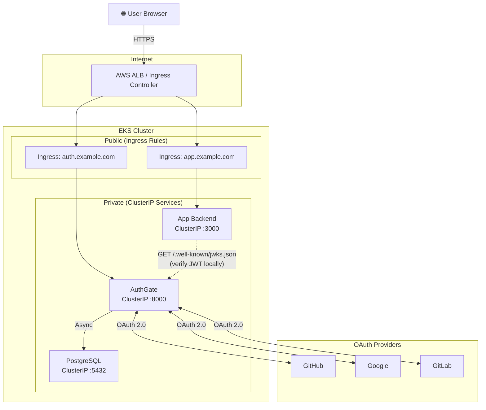
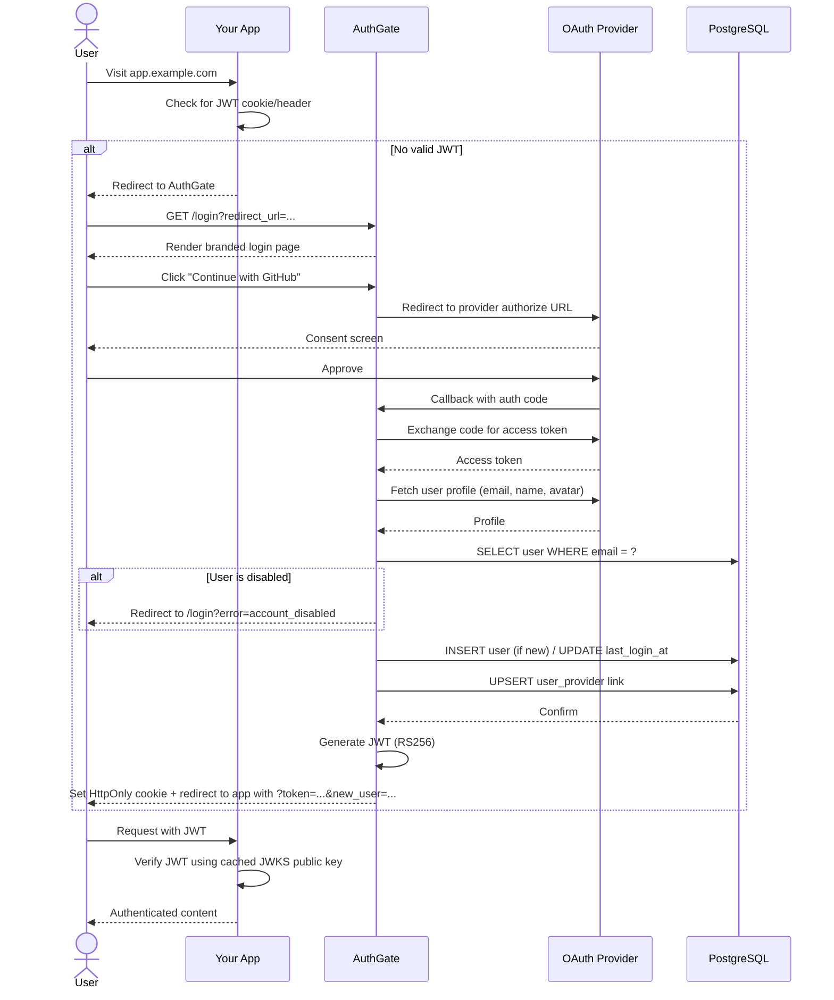

## Tech stack

| Layer | Technology |
|-------|-----------|
| Framework | FastAPI (async Python) |
| Database | PostgreSQL + asyncpg + SQLAlchemy 2.x |
| Auth | JWT (RS256) + OAuth 2.0 |
| Frontend | Jinja2 + vanilla CSS (no JS framework) |
| Container | Docker (multi-stage, ~50MB) |
| Orchestration | Helm / Docker Compose |
| CI/CD | GitHub Actions |
| Release | release-please (automated changelogs + version bumps) |

## Project structure

```
authgate/
├── app/
│   ├── main.py              # FastAPI entrypoint
│   ├── config.py            # YAML config loader with $VAR env-var resolution
│   ├── database.py          # Async SQLAlchemy engine + session factory
│   ├── models.py            # User + UserProvider SQLAlchemy models
│   ├── schemas.py           # Pydantic response schemas
│   ├── jwt_handler.py       # RS256 JWT + JWKS + state tokens
│   ├── oauth/
│   │   ├── base.py          # Abstract OAuthProvider + OAuthUser dataclass
│   │   ├── github.py        # GitHub OAuth adapter
│   │   ├── google.py        # Google OAuth adapter
│   │   └── gitlab.py        # GitLab OAuth adapter
│   ├── routes/
│   │   ├── auth.py          # /login, /auth/{provider}, /logout, OAuth callbacks
│   │   ├── api.py           # /api/verify, /api/userinfo
│   │   └── health.py        # /health
│   └── templates/
│       └── login.html       # Default branded login page (Jinja2)
├── deployments/
│   ├── docker-compose/      # Dev compose (builds from local Dockerfile)
│   └── helm/authgate/       # Helm chart
├── docker-compose.yml       # Zero-config end-user compose (pulls published image)
├── docs/                    # Starlight documentation site (this site)
├── .github/workflows/       # Docker publish, Helm publish, release-please, docs deploy
├── Dockerfile               # Production container
├── authgate.example.yaml    # Configuration reference
└── requirements.txt
```

## Kubernetes deployment topology



**Key design choices:**

- AuthGate is a **separate deployment** — not bundled with your app. Scales independently, can be shared across many apps.
- **Only AuthGate talks to OAuth providers** — your app never holds OAuth credentials.
- **Only AuthGate talks to the Postgres** user database — your app only sees JWTs.
- **Local JWT verification** — your app fetches the JWKS once, verifies tokens locally. No per-request network hop.

## Authentication flow



## JWT structure

AuthGate issues RS256 JWTs with these claims:

```json
{
  "sub": "550e8400-e29b-41d4-a716-446655440000",
  "email": "jane@example.com",
  "name": "Jane Doe",
  "provider": "github",
  "iat": 1743267722,
  "exp": 1743354122,
  "iss": "authgate"
}
```

| Claim | Type | Purpose |
|---|---|---|
| `sub` | UUID | User ID (primary key on `users` table) |
| `email` | string | User's email |
| `name` | string | Display name |
| `provider` | string | Which OAuth provider was used for THIS login |
| `iat` | unix ts | Issued at |
| `exp` | unix ts | Expiration (default: issue time + 24h) |
| `iss` | string | Always `"authgate"` — use this for `issuer` verification |

**Keys:**
- Generated once, stored at `{JWT_KEYS_DIR}/private.pem` and `public.pem`
- Private key never leaves the AuthGate container
- Public key served via `/.well-known/jwks.json`
- `kid` (key ID) is a truncated SHA-256 hash of the public key DER — lets you rotate keys later without breaking in-flight tokens

## State tokens (CSRF protection)

AuthGate uses HS256 JWTs as OAuth state tokens to prevent CSRF:

- Generated when user clicks a provider button
- Contains `redirect_url` and `provider` claims
- Signed with `SECRET_KEY` (symmetric, only AuthGate verifies)
- 10-minute expiry
- Verified on OAuth callback — if missing/expired/tampered, callback returns `?error=invalid_state`
